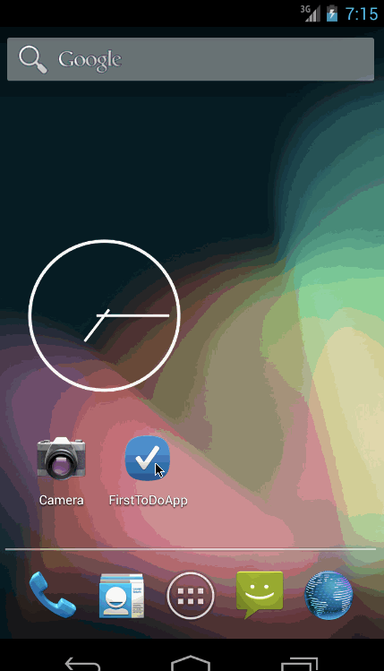

# 

This is an Android  application for creating a simple Todo List
Time spent: 23 hours spent in total

Completed user stories:

 * [x] Required: User can add to the list of ToDo Items
 * [x] Required: User can edit any item in the list
 * [x] Required: User can delete an item from the list
 * [x] Required: The list is persisted in the app so its saved even if user closes the app
 * [x] Optional: The app icon is updated
 * [x] Optional: Use a DialogFragment instead of new Activity for editing items
 * [x] Optional: Persist the todo items into SQLite instead of a text file
 * [x] Optional: Improve style of the todo items in the list using a custom adapter

 
Notes:

Walkthrough of all user stories:

GIF created with [LiceCap](http://www.cockos.com/licecap/).
